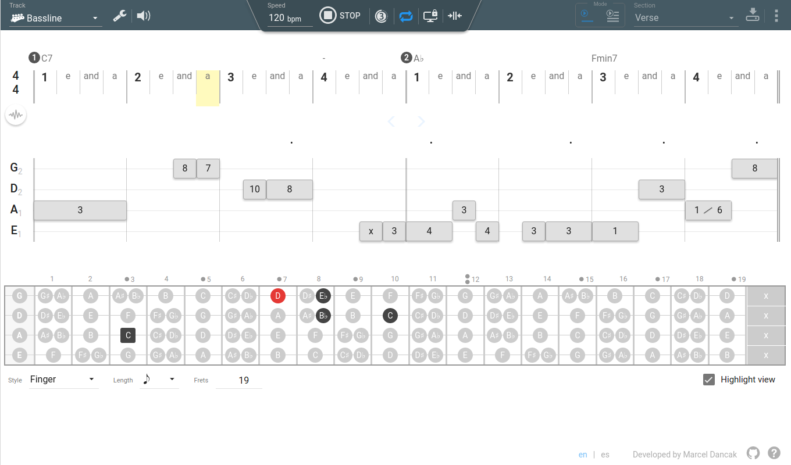
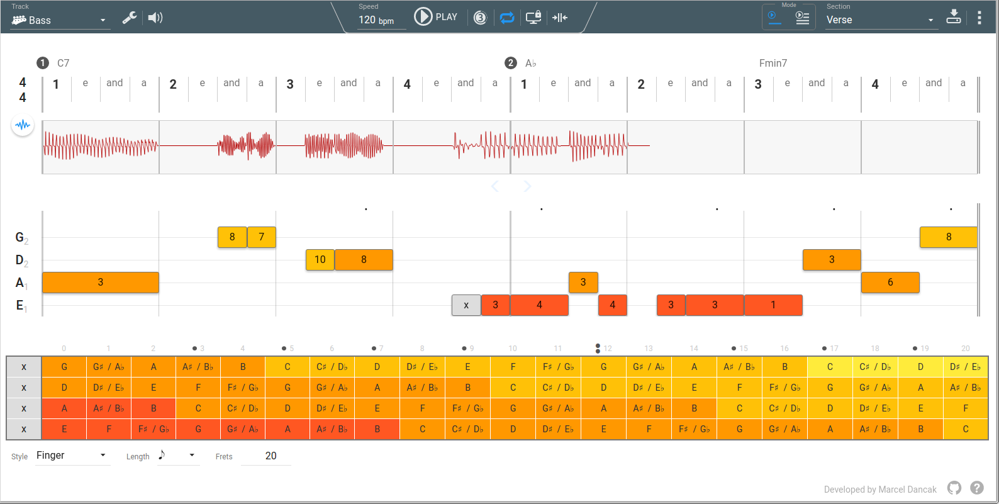
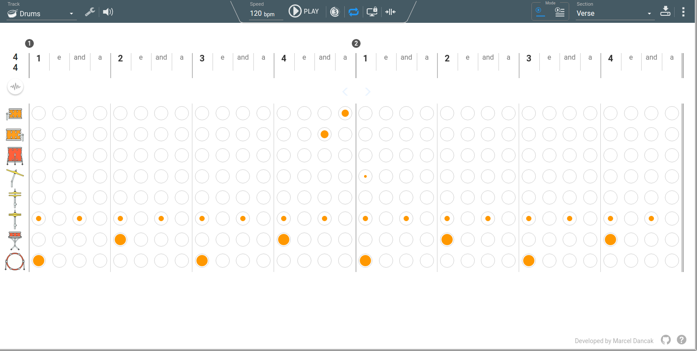
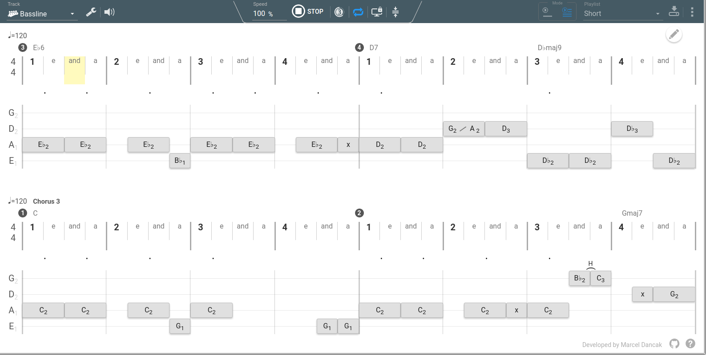

The main purpose of this application is to help starting bass players with their learing process.
Application is highly focused on rhythm aspect of the music by using easy to understand timeline
representation with labels for proper counting. It can be used to create various rhythmic excercises,
drums backing tracks, or bass covers.

**Main features:**

* various playback options to adjust playback speed, playback selection, repeating
* multiple tracks (instruments) support with separate volume control
* customizable bass sound labels (fret numbers, note names, ...)
* easy to use user interface
* pure HTML 5 application, can be served online or run locally

### Fretboard Highlight view (NEW)

### Bass Editor

### Drums/Percussions Editor

### Viewer Mode

It is highly recommended to use Blink/Webkit based browser. Application may not work properly in other browsers.

**List of supported browsers:**

* Chrome
* Chromium
* Opera

**Future plans:**

* Vibrato playing style for bass
* Configurable bass strings tunning
* Improve percussions (more configurability, sound samples, ...)
* Undo/Redo function for editor
* Build desktop application (Electron)
* Migrate code from Angular to Vue 2
* Musical score view

### [Open Application](http://rawgit.com/marcel-dancak/drums-and-bass/master/dist/latest/index.html)

### Examples

Here are some examples of projects. Please note, that you cannot save changes
in these online (remote) projects. Click on the link above to open application
for creating your own projects.

[Slap Funk (by Mannybass)](http://rawgit.com/marcel-dancak/drums-and-bass/master/dist/latest/index.html#SlapFunk)

[Cantos de Jubilo (by Mannybass)](http://rawgit.com/marcel-dancak/drums-and-bass/master/dist/latest/index.html#Cantos_de_Jubilo)

[Jamiroquai - Runaway](http://rawgit.com/marcel-dancak/drums-and-bass/master/dist/latest/index.html#Jamiroquai-Runaway)

[Patrice Rushen - Forget Me Nots](http://rawgit.com/marcel-dancak/drums-and-bass/master/dist/latest/index.html#PatriceRushen-ForgetMeNots)

[Sublime - Santeria](http://rawgit.com/marcel-dancak/drums-and-bass/master/dist/latest/index.html#Sublime-Santeria)

[Knight Rider](http://rawgit.com/marcel-dancak/drums-and-bass/master/dist/latest/index.html#KnightRider)

[Various short riffs](http://rawgit.com/marcel-dancak/drums-and-bass/master/dist/latest/index.html#Riffs)

### Project support

This application is free to use with all its features. There is a plan for the future to provide
some extra services oriented more toward content (lessons, covers) and support, that will hopefully
ensure sufficient financial resources to keep this project alive - implementation of new features,
bug-fixing, dedicated version for mobile devices, ...

If you would like to support this project directly, you can use [PayPal](https://www.paypal.me/MarcelDancak).
