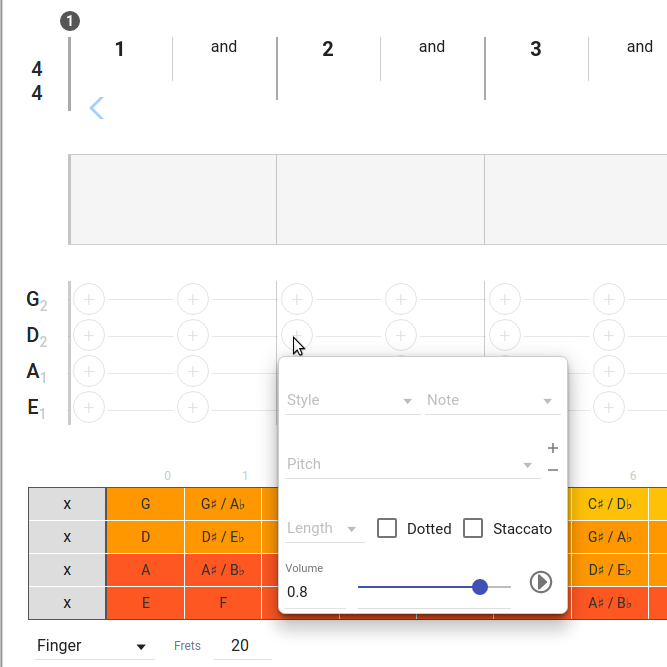
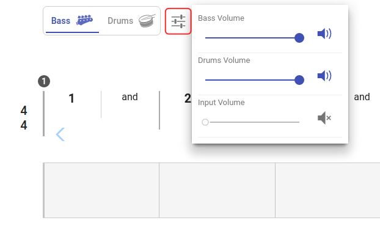

### [Demo](https://dl.dropboxusercontent.com/u/4466860/drums-and-bass/dist/latest/index.html)

Supported browsers:

* Chrome (preferred)
* Firefox

## Creating bass sounds

You can create a bass sound with two different ways:

* Move mouse pointer over the bass board area and open context menu by click (left or right) on the plus button

* Drag note from fretboard to bass board area

After a bass sound was defined, you can:

* edit it's properties in context menu by right click on it.
* change sound's note length by resizing sound box from it's right side
* move sound to different position by drag & drop
* copy sound to different position by drag & drop with pressed **Ctrl** key

### Special shortcuts

**Slide** - you can create a slide from two already defined bass sounds (on the same string) by resizing - first sound box must overlap with the second

**Hammer on & Pull off** - create two following sounds on the same string, select the second one and press 'H' or 'P' key to create hammer on or pull off relation

## Audio inut/output prefferences

Application use two independent output channels - one for the drums, second for the bass guitar.
You can also connect bass guitar throught input channel. By default, input channel is muted, when you enable it, audio graph visualization will use this channel instead of bass guitar playback.
